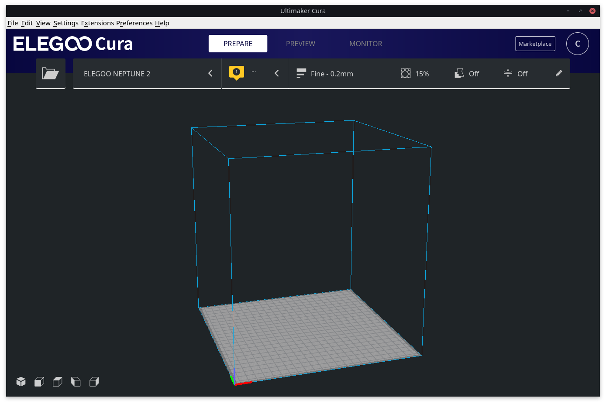

# Elegoo Cura Dots



Install Elegoo Cura default configuration on linux too.

# This configuration files don't work with all the Cura versions!
Seems like some update broke the configuration and as a result the slicing process 
go on forever. In this case, try updating more or using alternative 
way to install Cura.

## Installation on Arch (or derivatives)

Install with pacman:
```
$ sudo pacman -S cura
```

You can copy the configuration files in the right directory launching this:

```
git clone https://github.com/mr-chrome/elegoo-cura-dots ~/.local/share/cura
```

## Installation on Ubuntu/Debian (or derivatives)

Install with apt:
```
$ sudo apt install cura
```

Get the version number: 
```
$ cura --version

> 4.4.1
```

Remove default configuration directory.
Remember! The name of the directory **must** be the same as the version number 
got with the previous command!

```
$ rm -rf ~/.local/share/cura/4.4
```

Install the custom elegoo dots in the right directory:
```
git clone https://github.com/mr-chrome/elegoo-cura-dots ~/.local/share/cura/4.4
```
